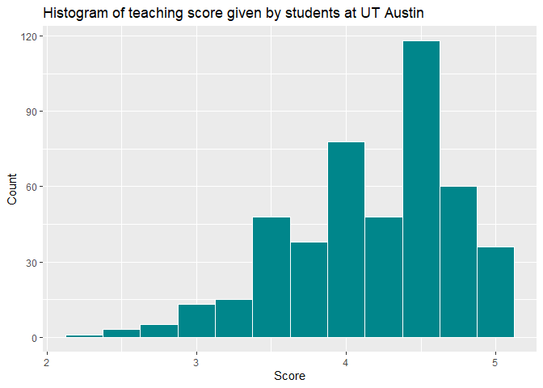

PS07
================

## *GitHub Documents*

This is an R Markdown format used for publishing markdown documents to
GitHub. When you click the **Knit** button all R code chunks are run and
a markdown file (.md) suitable for publishing to GitHub is generated.

## *Including Code*

You can include R code in the document as follows:

``` r
summary(cars)
```

    ##      speed           dist       
    ##  Min.   : 4.0   Min.   :  2.00  
    ##  1st Qu.:12.0   1st Qu.: 26.00  
    ##  Median :15.0   Median : 36.00  
    ##  Mean   :15.4   Mean   : 42.98  
    ##  3rd Qu.:19.0   3rd Qu.: 56.00  
    ##  Max.   :25.0   Max.   :120.00

## *Including Plots*

### Instructor evaluations given by UT Austin students

``` r
library(ggplot2)
library(moderndive)
ggplot(data = evals,
mapping = aes(x = score)) +
geom_histogram(binwidth = 0.25,
color = "white",
fill = "turquoise4")+
labs(x = "Score",
y = "Count",
title= "Histogram of teaching score given by students at UT Austin")
```

<!-- -->
